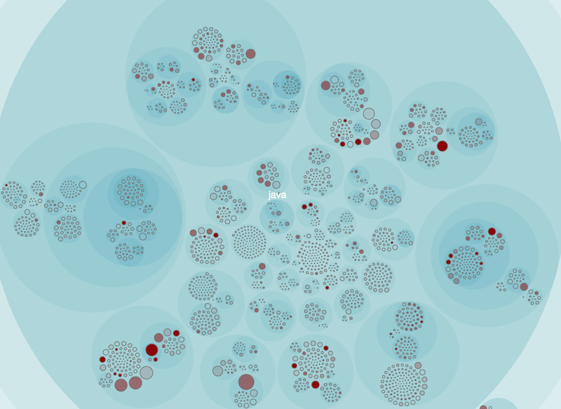
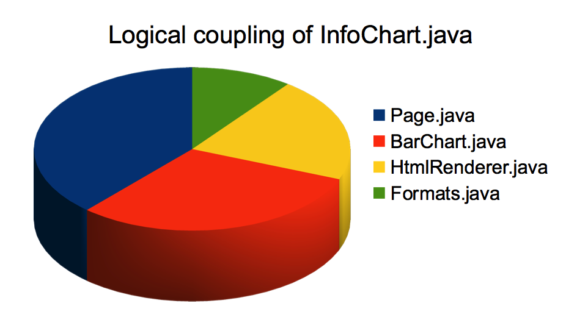
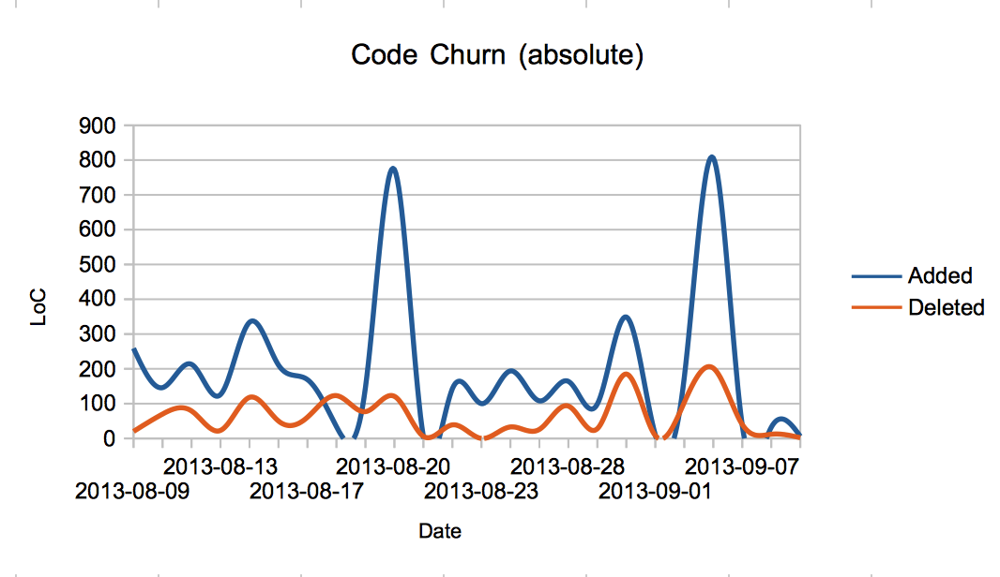

# Code Maat

Code Maat is a command line tool used to mine and analyze data from version-control systems (VCS).

Code Maat was developed to accompany the discussions in my books [Your Code as a Crime Scene](https://pragprog.com/book/atcrime/your-code-as-a-crime-scene) and
[Software Design X-Rays](https://pragprog.com/book/atevol/software-design-x-rays).

Note that the analyses have evolved into [CodeScene](https://codescene.io/), which automates all the analyses found in Code Maat and several new ones.

## Code Maat Badges

## The ideas behind Code Maat

To understand large-scale software systems we need to look at their evolution. The history of our system provides us with data we cannot derive from a single snapshot of the source code. Instead VCS data blends technical, social and organizational information along a temporal axis that let us map out our interaction patterns in the code. Analyzing these patterns gives us early warnings on potential design issues and development bottlenecks, as well as suggesting new modularities based on actual interactions with the code. Addressing these issues saves costs, simplifies maintenance and let us evolve our systems in the direction of how we actually work with the code.

### About the name

Maat was a goddess in ancient Egyptian myth. She was the one who gave us order out of the initial chaos in the universe. Code Maat hopes to continue the work of Maat, albeit on a smaller basis, by highlighting code with chaotic development practices and suggest the directions of future refactorings to bring order to it. Further, maat was used in ancient Egypt as a concept of truth. And metrics never lie (except when they do).

## License

Copyright © 2013 Adam Tornhill

Distributed under the [GNU General Public License v3.0](http://www.gnu.org/licenses/gpl.html).

## Usage

Code Maat is written in Clojure. To build it from source, use [leiningen](https://github.com/technomancy/leiningen):

	   lein uberjar

The command above will create a standalone `jar` containing all the dependencies.

Add the following line to your leiningen dependencies in case you want to use Code Maat as a library:

	   [code-maat "1.0.1"]

You can also build code-maat as a Docker image:

      docker build -t code-maat-app .

Code Maat operates on log files from version-control systems. The supported version-control systems are `git`, Mercurial (`hg`), `svn`, Perforce (`p4`), and Team Foundation Server (`tfs`). The log files are generated by using the version-control systems themselves as described in the following sections.

### Generating input data

#### Preparations

To analyze our VCS data we need to define a temporal period of interest. Over time, many design issues do get fixed and we don't want old data to interfere with our current analysis of the code. To limit the data Code Maat will consider, use one of the following flags depending on your version-control system:
+ *git:* Use the `--after=<date>` to specify the last date of interest. The `<date>` is given as `YYYY-MM-DD`.
+ *hg:* Use the `--date` switch to specify the last date of interest. The value is given as `">YYYY-MM-DD"`.
+ *svn:* Use the `-r` option to specify a range of interest, for example `-r {20130820}:HEAD`.
+ *p4:* Use the `-m` option to specify the last specified number of changelists, for example `-m 1000`.
+ *tfs:* Use the `/stopafter` option to specify the number of changesets, for example `/stopafter:1000`

#### Generate a Subversion log file using the following command:

          svn log -v --xml > logfile.log -r {YYYYmmDD}:HEAD

#### Generate a git log file using the following command:

The first options is the legacy format used in Your Code As A Crime Scene. Use the `-c git` parse option when [Running Code Maat](#running-code-maat).

          git log --pretty=format:'[%h] %aN %ad %s' --date=short --numstat --after=YYYY-MM-DD

There's a second supported Git format as well. It's more tolerant and faster to parse, so please prefer it over the plain `git` format described above. Use the `-c git2` parse option when [Running Code Maat](#running-code-maat).

          git log --all --numstat --date=short --pretty=format:'--%h--%ad--%aN' --no-renames --after=YYYY-MM-DD

Many codebases include third-party content or non-code artefacts,  which might generate noise in the analyses.
You can exclude such content via git's pathspecs that limit paths on the command line.
For example, let's say you want to exclude everything in a `vendor/ folder`. You would then append the following pattern to the `git log` commands above:

           -- . ":(exclude)vendor/*"

To exclude multiple folders, you just append more pathspecs:

           -- . ":(exclude)vendor/" ":(exclude)test/"

#### Generate a Mercurial log file using the following command:

          hg log --template "rev: {rev} author: {author} date: {date|shortdate} files:\n{files %'{file}\n'}\n" --date ">YYYY-MM-DD"

#### Generate a Perforce log file using the following command:

          p4 changes -s submitted -m 5000 //depot/project/... | cut -d ' ' -f 2 | xargs -I commitid -n1 sh -c 'p4 describe -s commitid | grep -v "^\s*$" && echo ""'
          
#### Generate a TFS log file using the following command from a Developer command-prompt:
###### Note:  The TFS CLI tool does not support custom date formatting.  The parser currently only supports the en-us default:  Friday, January 1, 2016 1:12:35 PM - you may need to adjust your system locale settings before using the following command.

          tf hist /path/to/workspace /noprompt /format:detailed /recursive

### Running Code Maat

You can run Code Maat directly from leiningen:

    	  lein run -l logfile.log -c <vcs>

If you've built a standalone jar (`lein uberjar`), run it with a simple java invocation. Please note that you need at least Java 8 installed:

     	  java -jar code-maat-0.8.6.jar -l logfile.log -c <vcs>

If you've built a docker container, then you can run it as

        docker run -v /home/xx/src/code-maat:/data -it code-maat-app -l /data/logfile.log -c <vcs>

where the /home/xx/src/code-maat is the host's directory containing the file logfile.log.

When invoked with `-h`, Code Maat prints its usage:

             adam$ java -jar code-maat-0.9.0.jar
             This is Code Maat, a program used to collect statistics from a VCS.
             Version: 0.9.0-SNAPSHOT
             
             Usage: program-name -l log-file [options]
             
             Options:
               -l, --log LOG                                         Log file with input data
               -c, --version-control VCS                             Input vcs module type: supports svn, git, git2, hg, p4, or tfs
               -a, --analysis ANALYSIS                      authors  The analysis to run (abs-churn, age, author-churn, authors, communication, coupling, entity-churn, entity-effort, entity-ownership, fragmentation, identity, main-dev, main-dev-by-revs, messages, refactoring-main-dev, revisions, soc, summary)
              --input-encoding INPUT-ENCODING                        Specify an encoding other than UTF-8 for the log file
               -r, --rows ROWS                                       Max rows in output
               -g, --group GROUP                                     A file with a pre-defined set of layers. The data will be aggregated according to the group of layers.
               -n, --min-revs MIN-REVS                      5        Minimum number of revisions to include an entity in the analysis
               -m, --min-shared-revs MIN-SHARED-REVS        5        Minimum number of shared revisions to include an entity in the analysis
               -i, --min-coupling MIN-COUPLING              30       Minimum degree of coupling (in percentage) to consider
               -x, --max-coupling MAX-COUPLING              100      Maximum degree of coupling (in percentage) to consider
               -s, --max-changeset-size MAX-CHANGESET-SIZE  30       Maximum number of modules in a change set if it shall be included in a coupling analysis
               -e, --expression-to-match MATCH-EXPRESSION            A regex to match against commit messages. Used with -messages analyses
               -t, --temporal-period TEMPORAL-PERIOD                 Instructs Code Maat to consider all commits during the same day as a single, logical commit
               -d, --age-time-now AGE-TIME_NOW                       Specify a date as YYYY-MM-dd that counts as time zero when doing a code age analysis
               -h, --help

### Optional: specify an encoding

By default, Code Maat expects your log files to be UTF-8. If you use another encoding, override the default with `--input-encoding`, for example `--input-encoding UTF-16BE`.

#### Generating a summary

When starting out, I find it useful to get an overview of the mined data. With the `summary` analysis, Code Maat produces such an overview:

   	   java -jar code-maat-0.9.0.jar -l logfile.log -c git -a summary

The resulting output is on csv format:

              statistic,                 value
              number-of-commits,           919
              number-of-entities,          730
              number-of-entities-changed, 3397
              number-of-authors,            79

If you use the second Git format, just specify `git2` instead:

   	   java -jar code-maat-0.9.0.jar -l logfile2.log -c git2 -a summary

#### Mining organizational metrics

By default, Code Maat runs an analysis on the number of authors per module. The authors analysis is based on the idea that the more developers working on a module, the larger the communication challenges. The analysis is invoked with the following command:

   	   java -jar code-maat-0.9.0.jar -l logfile.log -c git

The resulting output is on CSV format:

              entity,         n-authors, n-revs
              InfoUtils.java, 12,        60
              BarChart.java,   7,        30
              Page.java,       4,        27
              ...

In example above, the first column gives us the name of module, the second the total number of distinct authors that have made commits on that module, and the third column gives us the total number of revisions of the module. Taken together, these metrics serve as predictors of defects and quality issues.

#### Mining logical coupling

Logical coupling refers to modules that tend to change together. Modules that are logically coupled have a hidden, implicit dependency between them such that a change to one of them leads to a predictable change in the coupled module. To analyze the logical coupling in a system, invoke Code Maat with the following arguments:

              java -jar code-maat-0.9.0.jar -l logfile.log -c git -a coupling

The resulting output is on CSV format:

              entity,          coupled,        degree,  average-revs
              InfoUtils.java,  Page.java,      78,      44
              InfoUtils.java,  BarChart.java,  62,      45
              ...

In the example above, the first column (`entity`) gives us the name of the module, the second (`coupled`) gives us the name of a logically coupled module, the third column (`degree`) gives us the coupling as a percentage (0-100), and finally `average-revs` gives us the average number of revisions of the two modules. To interpret the data, consider the `InfoUtils.java` module in the example output above. The coupling tells us that each time it's modified, it's a 78% risk/chance that we'll have to change our `Page.java` module too. Since there's probably no reason they should change together, the analysis points to a part of the code worth investigating as a potential target for a future refactoring.

### Calculate code age

The change frequency of code is a factor that should (but rarely do) drive the evolution of a software architecture. In general, you want to stabilize as much code as possible. A failure to stabilize means that you need to maintain a working knowledge of those parts of the code for the life-time of the system.

One way to measure the stability of a software architecture is by a code age analysis:

              java -jar code-maat-0.9.0.jar -l logfile.log -c git -a age

The `age` analysis grades each module based on the date of last change. The measurement unit is age in months. Here's how the result may look:

              entity,age-months
              src/code_maat/app/app.clj,2
              project.clj,4
              src/code_maat/parsers/perforce.clj,5
              ...

By default, Code Maat uses the current date as starting point for a code age analysis. You specify a different start time with the command line argument `--age-time-now`.

By using the techniques from [Your Code as a Crime Scene](https://pragprog.com/book/atcrime/your-code-as-a-crime-scene) we visualize the system with each module marked-up by its age (the more `red`, the more recent changes to the code):

.

### Visualise your Results

Code Maat doesn't include any visualizations itself. However, you do have a bunch of options.

One option is [CodeScene](http://www.empear.com/#empear-products) which is [free for open source](https://codescene.io/) and delivers all these analyses as a service. CodeScene is also available in an [on-premise version](http://www.empear.com/products/codescene-on-premise/). CodeScene is a complete application with automated repository mining, visualizations, and is built around the ideas prototyped in Code Maat.

I also present a whole suite of different visualization techniques and options in [Your Code as a Crime Scene](https://pragprog.com/book/atcrime/your-code-as-a-crime-scene), so do check out the book if you want to dive deeper. You can also look at some of the basic tools I've open sourced such as [Metrics Tree Map](https://github.com/adamtornhill/MetricsTreeMap):

.

Yet another alternative is to save the generated CSV to a file and import it into a spreadsheet program such as OpenOffice or Excel. That allows us to generate charts such as the ones below:

.

## Code churn measures

Code churn is related to post-release defects. Modules with higher churn tend to have more defects. There are several different aspects of code churn. I intend to support several of them in Code Maat.

### Absolute churn

The absolute code churn numbers are calculated with the `-a abs-churn` option. Note that the option is only available for `git`. The analysis will output a CSV table with the churn accumulated per date:

             date,       added, deleted
             2013-08-09,   259,      20
             2013-08-19,   146,      77
             2013-08-21,     5,       6
             2013-08-20,   773,     121
             2013-08-30,   349,     185
             ...

Visualizing the result allows us to spot general trends over time:

.

### Churn by author

The idea behind this analysis is to get an idea of the overall contributions by each individual. The analysis is invoked with the `-a author-churn` option. The result will be given as CSV:

             author,        added, deleted
             Adam Tornhill, 13826,    1670
             Some One Else,   123,      80
             Mr Petersen,       3,       3
             ...

And, of course, you wouldn't use this data for any performance evaluation; it wouldn't serve well (in case anything should be rewarded it would be a net deletion of code - there's too much of it in the world).

### Churn by entity

The pre-release churn of a module is a good predictor of its number of post-release defects. Such an analysis is supported in Code Maat by the `-a entity-churn` option.

Note: Some research suggests that relative churn measures are better, while others don't find any significant differences. The metrics calculated by Code Maat are absolute for now because it's easier to calculate. I'm likely to include support for relative churn too.

## Ownership patterns

Once we have mined the organizational metrics described above, we may find we have multiple developers working on the same modules. How is their effort distributed? Does a particular module have a major developer or is everyone contributing a small piece? Let's find out by running the `-a entity-ownership` analysis. This analysis gives us the following output:

             entity,               author,  added, deleted
             analysis/authors.clj,    apt,    164,      98
             analysis/authors.clj,    qew,     81,      10
             analysis/authors.clj,     jt,     42,      32
             analysis/entities.clj,   apt,     72,      24
             ...

Another ownership view is to consider the effort spent by individual authors on the different entities in the system. This analysis is run by the `-a entity-effort` option. The analysis gives us the following table:

             entity,                author, author-revs, total-revs
             analysis/authors.clj,     apt,           5,         10
             analysis/authors.clj,     qew,           3,         10
             analysis/authors.clj,      jt,           1,         10
             analysis/authors.clj,     apt,           1,         10
             ...

This information may be a useful guide to find the right author to discuss functionality and potential refactorings with. Just note that the ownership metrics are sensitive to the same biases as the churn metrics; they're both heuristics and no absolute truths.

## Temporal periods

Sometimes we'd like to find patterns that manifests themselves over multiple commits. Code Maat provides the `--temporal-period` switch that let you consider all commits within a day as a logical change. Just provide the switch and add a digit - in the future that digit may even mean something; Right now the aggregation is limited to commits within a single day.

### Intermediate results

Code Maat supports an `identity` analysis. By using this switch, Code Maat will output the intermediate parse result of the raw VCS file. This can be useful either as a debug aid or as input to other tools.

### JVM options

Code Maat uses the Incanter library. By default, Incanter will create an `awt frame`. You can suppress the frame by providing the following option to your `java` command: `-Djava.awt.headless=true`.
Code Maat is quite memory hungry, particularly when working with larger change sets. Thus, I recommend specifying a larger heap size than the `JVM` defaults: `-Xmx4g`.
Note that when running Code Maat through [leiningen](https://github.com/technomancy/leiningen), those options are already configured in the `project.clj` file.

## Limitations

The current version of Code Maat processes all its content in memory. Thus, it may not scale to large input files (however, it depends a lot on the combination of parser and analysis). The recommendation is to limit the input by specifying a sensible start date (as discussed initially, you want to do that anyway to avoid confounds in the analysis).

## Future directions

In future versions of Code Maat I plan to add more analysis methods such as code churn and developer patterns.
I also plan on direct visualization support and a database backed analysis to allow processing of larger log files. Further, I plan to add a worked example. That example will be a case study of some well-known open source code. Until then, I hope you find Code Maat useful in its initial shape.
